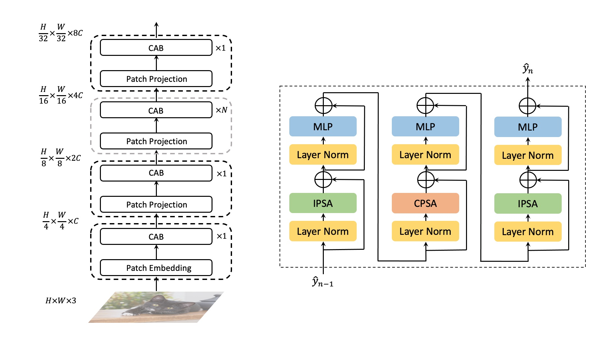

# CAT: Cross Attention in Vision Transformer

This is official implement of ["CAT: Cross Attention in Vision Transformer"]().

The paper will be public later.

## Abstract

Since Transformer has found widespread use in NLP, the potential of Transformer in CV has been realized and has inspired many new approaches. However, the computation required for replacing word tokens with image patches for Transformer after the tokenization of the image is vast(e.g., ViT), which bottlenecks model training and inference. In this paper, we propose a new attention mechanism in Transformer termed Cross Attention, which alternates attention inner the image patch instead of the whole image to capture local information and apply attention between image patches which are divided from single-channel feature maps to capture global information. Both operations have less computation than standard self-attention in Transformer. By alternately applying attention inner patch and between patches, we implement cross attention to maintain the performance with lower computational cost and build a hierarchical network called Cross Attention Transformer(CAT) for other vision tasks. Our base model achieves state-of-the-arts on ImageNet-1K, and improves the performance of other methods on COCO and ADE20K, illustrating that our network has the potential to serve as general backbones.

CAT achieves strong performance on COCO object detection(implemented with [mmdectection](https://github.com/open-mmlab/mmdetection)) and ADE20K semantic segmentation(implemented with [mmsegmantation](https://github.com/open-mmlab/mmsegmentation)).



## Pretrained Models and Results on ImageNet-1K

| name  | resolution |acc@1 | acc@5 | #params | FLOPs | model | log |
| :---: | :---: | :---: | :---: | :---: | :---: |:---: |:---: |
| CAT-T | 224x224 | 80.3 | 95.0 | 17M | 2.8G | [github](https://github.com/linhezheng19/CAT/releases/download/untagged-0f39dafcec47a4003737/cat_tiny.pth) | [github](https://github.com/linhezheng19/CAT/releases/download/untagged-66ed5a7bb12a93907ecf/cat_tiny_log.txt)|
| CAT-S | 224x224 | 81.8 | 95.6 | 37M | 5.9G | [github](https://github.com/linhezheng19/CAT/releases/download/untagged-0f39dafcec47a4003737/cat_small.pth) | [github](https://github.com/linhezheng19/CAT/releases/download/untagged-66ed5a7bb12a93907ecf/cat_small_log.txt) |
| CAT-B | 224x224 | 82.8 | 96.1 | 52M | 8.9G  | [github](https://github.com/linhezheng19/CAT/releases/download/untagged-0f39dafcec47a4003737/cat_base.pth) | [github](https://github.com/linhezheng19/CAT/releases/download/untagged-66ed5a7bb12a93907ecf/cat_base_log.txt) |
| CAT-T-v2 | 224x224 | 81.7 | 95.5 | 36M | 3.9G  | Coming | Coming|

## Models and Results on Object Detection (COCO 2017 val)

| Backbone | Method | pretrain | Lr Schd | box mAP | mask mAP | #params | FLOPs | model | log |
| :---: | :---: | :---: | :---: | :---: | :---: | :---: | :---: | :---: | :---: |
| CAT-S | Mask R-CNN<sup>+</sup> | ImageNet-1K | 1x | 41.6 | 38.6 | 57M | 295G | [github](https://github.com/linhezheng19/CAT/releases/download/untagged-0f39dafcec47a4003737/mask_rcnn_cat_small_1x_ms.pth) | [github](https://github.com/linhezheng19/CAT/releases/download/untagged-66ed5a7bb12a93907ecf/mask_rcnn_cat_small_1x_ms.txt)|
| CAT-B | Mask R-CNN<sup>+</sup> | ImageNet-1K | 1x | 41.8 | 38.7 | 71M | 356G | [github](https://github.com/linhezheng19/CAT/releases/download/untagged-0f39dafcec47a4003737/mask_rcnn_cat_base_1x_ms.pth) | [github](https://github.com/linhezheng19/CAT/releases/download/untagged-66ed5a7bb12a93907ecf/mask_rcnn_cat_base_1x_ms.txt)|
| CAT-S | FCOS | ImageNet-1K | 1x | 40.0 | - | 45M | 245G | [github](https://github.com/linhezheng19/CAT/releases/download/untagged-0f39dafcec47a4003737/fcos_cat_small_1x.pth) | [github](https://github.com/linhezheng19/CAT/releases/download/untagged-66ed5a7bb12a93907ecf/fcos_cat_samll_1x.txt)|
| CAT-B | FCOS | ImageNet-1K | 1x | 41.0 | - | 59M | 303G | [github](https://github.com/linhezheng19/CAT/releases/download/untagged-66ed5a7bb12a93907ecf/fcos_cat_base_1x.pth) | [github](https://github.com/linhezheng19/CAT/releases/download/untagged-66ed5a7bb12a93907ecf/fcos_cat_base_1x.txt)|
| CAT-S | ATSS | ImageNet-1K | 1x | 42.0 | - | 45M | 243G | [github](https://github.com/linhezheng19/CAT/releases/download/untagged-0f39dafcec47a4003737/atss_cat_small_1x.pth) | [github](https://github.com/linhezheng19/CAT/releases/download/untagged-66ed5a7bb12a93907ecf/atss_cat_small_1x.txt)|
| CAT-B | ATSS | ImageNet-1K | 1x | 42.5 | - | 59M | 303G | [github](https://github.com/linhezheng19/CAT/releases/download/untagged-0f39dafcec47a4003737/atss_cat_base_1x.pth) | [github](https://github.com/linhezheng19/CAT/releases/download/untagged-66ed5a7bb12a93907ecf/atss_cat_base_1x.txt)|
| CAT-S | RetinaNet | ImageNet-1K | 1x | 40.1 | - | 47M | 276G | [github](https://github.com/linhezheng19/CAT/releases/download/untagged-0f39dafcec47a4003737/retinanet_cat_small_1x.pth) | [github](https://github.com/linhezheng19/CAT/releases/download/untagged-66ed5a7bb12a93907ecf/retinanet_cat_small_1x.txt)|
| CAT-B | RetinaNet | ImageNet-1K | 1x | 41.4 | - | 62M | 337G | [github](https://github.com/linhezheng19/CAT/releases/download/untagged-0f39dafcec47a4003737/retinanet_cat_base_1x.pth) | [github](https://github.com/linhezheng19/CAT/releases/download/untagged-66ed5a7bb12a93907ecf/retinanet_cat_base_1x.txt)|
| CAT-S | Cascade R-CNN | ImageNet-1K | 1x | 44.1 | - | 82M | 270G | [github](https://github.com/linhezheng19/CAT/releases/download/untagged-0f39dafcec47a4003737/cascade_rcnn_cat_small_1x.pth) | [github](https://github.com/linhezheng19/CAT/releases/download/untagged-66ed5a7bb12a93907ecf/cascade_cat_small_1x.txt)|
| CAT-B | Cascade R-CNN | ImageNet-1K | 1x | 44.8 | - | 96M | 330G | [github](https://github.com/linhezheng19/CAT/releases/download/untagged-0f39dafcec47a4003737/cascade_rcnn_cat_base_1x.pth) | [github](https://github.com/linhezheng19/CAT/releases/download/untagged-66ed5a7bb12a93907ecf/cascade_cat_base_1x.txt)|
| CAT-S | Cascade R-CNN<sup>+</sup> | ImageNet-1K | 1x | 45.2 | - | 82M | 270G | [github](https://github.com/linhezheng19/CAT/releases/download/untagged-0f39dafcec47a4003737/cascade_rcnn_cat_small_1x_ms.pth) | [github](https://github.com/linhezheng19/CAT/releases/download/untagged-66ed5a7bb12a93907ecf/cascade_cat_small_1x_ms.txt)|
| CAT-B | Cascade R-CNN<sup>+</sup> | ImageNet-1K | 1x | 46.3 | - | 96M | 330G | [github](https://github.com/linhezheng19/CAT/releases/download/untagged-0f39dafcec47a4003737/cascade_rcnn_cat_base_1x_ms.pth) | [github](https://github.com/linhezheng19/CAT/releases/download/untagged-66ed5a7bb12a93907ecf/cascade_cat_base_1x_ms.txt)|

Note: <sup>+</sup> indicates multi-scale training.

## Models and Results on Semantic Segmentation (ADE20K val)

| Backbone | Method | pretrain | Crop Size | Lr Schd | mIoU | mIoU (ms+flip) | #params | FLOPs | model | log |
| :---: | :---: | :---: | :---: | :---: | :---: | :---: | :---: | :---: | :---: | :---: | 
| CAT-S | Semantic FPN | ImageNet-1K | 512x512 | 80K | 40.6 | 42.1 | 41M | 214G | [github](https://github.com/linhezheng19/CAT/releases/download/untagged-0f39dafcec47a4003737/semantic_fpn_cat_small_80k_ade20k.pth) | [github](https://github.com/linhezheng19/CAT/releases/download/untagged-66ed5a7bb12a93907ecf/semantic_fpn_cat_small_80k_ade20k.txt) |
| CAT-B | Semantic FPN | ImageNet-1K | 512x512 | 80K | 42.2 | 43.6 | 55M | 276G | [github](https://github.com/linhezheng19/CAT/releases/download/untagged-0f39dafcec47a4003737/semantic_fpn_cat_base_80k_ade20k.pth) | [github](https://github.com/linhezheng19/CAT/releases/download/untagged-66ed5a7bb12a93907ecf/semantic_fpn_cat_base_80k_ade20k.txt) |
| CAT-S | Semantic FPN | ImageNet-1K | 512x512 | 160K | 42.2 | 42.8 | 41M | 214G | [github](https://github.com/linhezheng19/CAT/releases/download/untagged-0f39dafcec47a4003737/semantic_fpn_cat_small_160k_ade20k.pth) | [github](https://github.com/linhezheng19/CAT/releases/download/untagged-66ed5a7bb12a93907ecf/semantic_fpn_cat_small_160k_ade20k.txt) |
| CAT-B | Semantic FPN | ImageNet-1K | 512x512 | 160K | 43.2 | 44.9 | 55M | 276G | [github](https://github.com/linhezheng19/CAT/releases/download/untagged-0f39dafcec47a4003737/semantic_fpn_cat_base_160k_ade20k.pth) | [github](https://github.com/linhezheng19/CAT/releases/download/untagged-66ed5a7bb12a93907ecf/semantic_fpn_cat_base_160k_ade20k.txt) |

## Citing CAT

The paper will be public later.

You can cite it for now:
```
@misc{CAT-2021,
    title={{CAT}: Cross Attention in Vision Transformer},
    author={linhezheng},
    howpublished = {\url{https://github.com/linhezheng19/CAT}},
    year={2021}
}
```

## Started

Please refer to [get_started](get_started.md).

## Acknowledgement

Our implementation is mainly based on [Swin](https://github.com/microsoft/Swin-Transformer).
